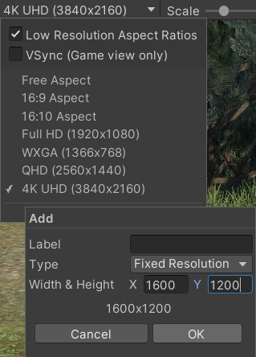

# The hitchhiker’s guide to endangered species pose estimation

## Installation
1. Install Unity Hub from: https://unity.com/download start Unity Hub and sign in or create an account.
2. Install Unity Version: 2022.2.9f1 from https://unity.com/releases/editor/archive.

## Project Setup
1. In Unity Hub click on "New project", and create a new 3D project

2. Now it is necessary to add assets from [Unity Asset Store](https://assetstore.unity.com/) to the project. At the asset page in Unity Store click on Add to My Assets and Accept the terms.
    - [Terrain Texture](https://assetstore.unity.com/packages/2d/textures-materials/nature/terrain-textures-pack-free-139542)
    - [Snow Materials](https://assetstore.unity.com/packages/2d/textures-materials/4-snow-materials-high-quality-materials-collection-69201)
    - [Book Of The Dead](https://assetstore.unity.com/packages/essentials/tutorial-projects/book-of-the-dead-environment-hdrp-121175)

    

3. In Unity go to Window > Package Manager > Packages: My Assets (top left corner) 
    - Download and import previously added packages.

    

    - Book Of The Dead is a whole project and during importing two warning windows will show, click "Import" and then "Instal/Upgrade". It is not necessary to import all assets. After selecting assets you can click "next" and then "import". 

    

        
        
        
        
    

4. Download this repository and copy all files in the Assets folder in the project Assets folder. The project already contains folder `_TerrainAutoUpgrade` it is safe to overwrite this folder with files in the repository folder.

    

5. Go to Window > Rendering > HDRP Wizard and click "Convert All Built-in Materials to HDRP"

6. In the Game window add a new screen resolution

    

7. Go to File > Build Setting and add scenes
    - scenes can be added by dropping scene objects into the window (order matters)

    

## Model setup
We used a paid model, therefore we can not make it available. In each scene is placeholder a model instead with all necessary components. A new model of an animal should be setup based on the components and hierarchy of the placeholder.

1. In order to get the position of different keypoints it is necessary to place empty game objects representing individual keypoints as a child of different parts of the model. Keypoint should be placed as a child of the part that deforms during the animation, in order to move with the model part.

    

2. Select Main Camera and in inspector find an array with name keypoints in the CameraCapture component and add references to all keypoint game objects to the array by dragging and dropping them on an empty field in the array.

    Find a game object in a model hierarchy with SkinnedMeshRenderer and add a reference to this object to the Main Camera GetMeshPosition component.

    Also, put all necessary references to the AnimalModel Agent component

    
    

        
        
    

3. If a new animation is created it is necessary to add capture and completed events. The first signalizes when the animation screenshot should be taken and the second resumes walking animation.

    

    

4. Animations are started by triggers, if a new animation is added it is necessary to add a new trigger. The name of the trigger also needs to be added to the Animation_names array in the Agent component.

    

## Usage
1. Most of the parameters of simulation can be set in Assets  > SyntheticGeneration-Assets > Scripts > GlobalVariables.cs
2. Simulation can be run from the main_menu scene which allows to set some of the variables or directly from individual scenes. If the simulation is started from the scene, all variables have to be adjusted manually in GlobalVariables.cs file.